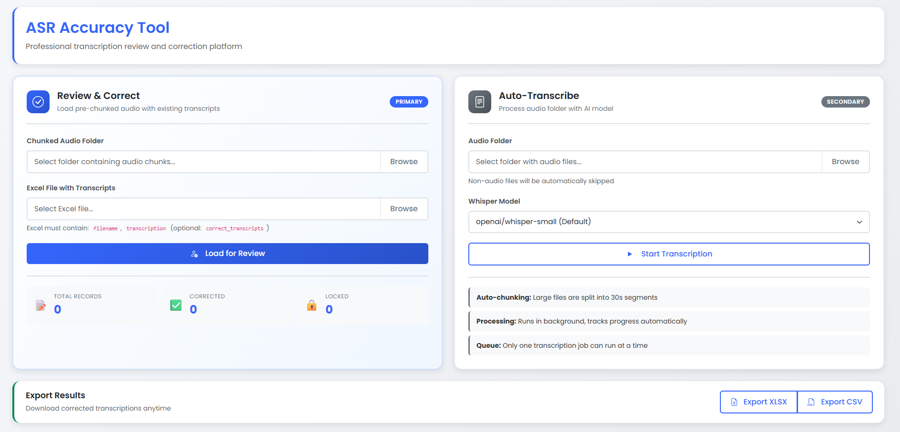

# Speech Annotation Workbench

> Transcription review and correction platform with background processing, progress tracking, and session persistence

[](https://www.python.org/downloads/)
[](https://flask.palletsprojects.com/)
[](LICENSE)

A powerful, user-friendly web application for reviewing and correcting ASR (Automatic Speech Recognition) transcriptions. Built for data annotation teams, researchers, and anyone working with speech-to-text accuracy improvement.


---

## ✨ Key Features

### 🎯 Two Powerful Workflows

1. **Review & Correct** (Primary)
   - Load pre-chunked audio with existing Excel transcripts
   - Inline editing with real-time save
   - Perfect for manual correction workflows

2. **Auto-Transcribe** (Secondary)
   - Point to any folder of audio files
   - Automatic chunking and AI transcription
   - Background processing with progress tracking

### 🚀 Advanced Capabilities

- **Background Job Processing**: Handle thousands of files without blocking the UI
- **Progress Tracking**: Real-time progress bars and status updates
- **Job Queue Management**: One job per type at a time, prevents conflicts
- **Session Persistence**: LocalStorage tracking remembers what you've corrected
- **Row Locking**: Lock completed rows to prevent accidental edits
- **Responsive Design**: Works perfectly on desktop, tablet, and mobile
- **Export Options**: Download as CSV or Excel anytime
- **Smart Audio Handling**: FFmpeg-based streaming for large files

---

## 🎬 Quick Start

> **TL;DR**: See [QUICK_START.md](QUICK_START.md) for a 5-minute setup guide.



### Prerequisites

- **Python 3.10+**
- **FFmpeg** (for audio processing)
- 4GB+ RAM recommended

### Installation

```bash
# 1. Clone the repository
git clone https://github.com/inboxpraveen/Speech-Annotation-Workbench.git
cd Speech-Annotation-Workbench

# 2. Create a virtual environment
python -m venv venv
source venv/bin/activate  # Windows: venv\Scripts\activate

# 3. Install dependencies
pip install -r requirements.txt

# 4. Install FFmpeg (if not already installed)
# Ubuntu/Debian: sudo apt install ffmpeg
# macOS: brew install ffmpeg
# Windows: Download from https://ffmpeg.org/

# 5. Run the application
python app.py
```

Open your browser to **http://localhost:5000**

---

## 📖 Usage Guide

### Workflow 1: Review & Correct Existing Transcripts

**Best for**: Teams with pre-transcribed audio chunks and Excel files

1. Click on the **"Review & Correct"** card (blue, left side)
2. Browse and select your **chunked audio folder**
3. Browse and select your **Excel file** (must contain `filename` and `transcription` columns)
4. Click **"Load for Review"**
5. Wait for import to complete (progress shown in banner)
6. Review and edit transcripts in the table below
7. Click **"Save"** after each correction
8. Lock rows when finalized
9. Export results anytime

**Excel Format Example**:
```csv
filename,transcription,correct_transcripts
chunk_001.wav,Hello world,Hello world
chunk_002.wav,This is a test,This is a test
```

### Workflow 2: Auto-Transcribe Audio Folder

**Best for**: Starting from scratch with raw audio files

1. Click on the **"Auto-Transcribe"** card (gray, right side)
2. Browse and select your **audio folder**
3. Select a **Whisper model** (default: small, balanced accuracy/speed)
4. Click **"Start Transcription"**
5. Monitor progress in the top banner
6. Audio is automatically:
   - Converted to 16kHz mono WAV
   - Chunked into 30-second segments
   - Transcribed with AI
7. Review and correct results in the table
8. Export when done

**Supported Audio Formats**: MP3, WAV, WMA, MPEG, OPUS, FLAC, M4A

---

## 🎨 User Interface

### Main Dashboard

- **Feature Cards**: Two clearly separated workflows with visual distinction
- **Job Status Banner**: Auto-appears when jobs are running, shows real-time progress
- **Statistics Panel**: Track total, corrected, and locked records at a glance
- **Export Controls**: Quick access to CSV/XLSX export

### Transcription Table

- **Audio Player**: Play each segment directly in browser
- **Original Transcript**: Read-only reference column
- **Corrected Transcript**: Editable field with autosave
- **Action Buttons**:
  - **Save**: Persist your corrections
  - **Lock**: Prevent further edits
  - **Unlock**: Re-enable editing

### Progress Tracking

- Progress bar shows percentage completion
- Item counter shows "X / Y items processed"
- Auto-refreshes every 2 seconds during active jobs
- Dismissible when complete

---

## 🔧 Configuration

### Environment Variables

```bash
# Optional: Set default model
export ASR_MODEL="openai/whisper-small"

# Required for production: Set secret key
export FLASK_SECRET_KEY="your-secure-random-key-here"
```

### Model Selection

Available Whisper models (speed vs. accuracy trade-off):

| Model | Speed | Accuracy | Use Case |
|-------|-------|----------|----------|
| `openai/whisper-tiny` | ⚡⚡⚡ | ⭐⭐ | Quick tests, drafts |
| `openai/whisper-base` | ⚡⚡ | ⭐⭐⭐ | Balanced, general use |
| `openai/whisper-small` | ⚡ | ⭐⭐⭐⭐ | **Default**, production |

### Storage Location

All data is stored in the `data/` directory (auto-created):

```
data/
├── segments/          # Audio chunks organized by job_id
├── exports/           # Exported CSV/XLSX files
├── transcriptions.csv # Main database
└── jobs.json          # Job status tracking
```

---

## 💡 Advanced Features

### LocalStorage Persistence

The tool automatically tracks which records you've corrected using browser localStorage:

- Corrections persist across sessions
- Survive browser refresh
- Track completion progress
- Visual indicators for corrected rows

**Clear tracking**: Open browser console and run:
```javascript
localStorage.removeItem('asr_corrections_tracker');
```

### Background Processing

Jobs run in separate threads using Python's built-in threading:

- UI remains responsive during long operations
- Progress updates every 2 seconds
- Only one job per type can run (prevents conflicts)
- Jobs survive brief network interruptions
- **No additional services required** (no Redis, RabbitMQ, or Celery)

For distributed processing across multiple servers, consider migrating to Celery. See [PROJECT_DOCUMENTATION.md](PROJECT_DOCUMENTATION.md) for details.

### Row Locking

Prevent accidental overwrites:

1. Edit and save a record
2. Click **"Lock"** when finalized
3. Row turns yellow and becomes read-only
4. Click **"Unlock"** if changes needed

---

## 📊 Project Structure

```
Speech-Annotation-Workbench/
├── app.py                 # Entry point
├── requirements.txt       # Dependencies
├── README.md              # This file
├── PROJECT_DOCUMENTATION.md  # Detailed technical docs
├── asr_tool/              # Main package
│   ├── __init__.py        # Flask app factory
│   ├── config.py          # Configuration
│   ├── routes.py          # API endpoints
│   └── services/          # Business logic
│       ├── audio.py       # Audio processing
│       ├── model.py       # Whisper models
│       ├── storage.py     # CSV database
│       └── job_manager.py # Background jobs
├── static/                # Frontend assets
│   ├── css/style.css      # Styles
│   ├── js/script.js       # JavaScript
│   └── images/            # Images
├── templates/             # HTML templates
│   ├── base.html
│   └── index.html
└── data/                  # Runtime data (auto-created)
```

---

## 🐛 Troubleshooting

### FFmpeg Not Found

```bash
# Verify FFmpeg is installed
ffmpeg -version

# If not found, install it:
# Ubuntu/Debian
sudo apt update && sudo apt install ffmpeg

# macOS
brew install ffmpeg

# Windows
# Download from https://ffmpeg.org/download.html
# Add to PATH environment variable
```

### Job Stuck in "Running"

If application crashes while a job is running:

1. Stop the application
2. Edit `data/jobs.json`
3. Change job status from `"running"` to `"failed"`
4. Restart application

### Out of Memory

For large audio files:

1. Use a smaller Whisper model (`tiny` or `base`)
2. Reduce segment duration (edit `config.py`)
3. Increase system RAM
4. Process fewer files at once

### Excel Import Fails

Ensure your Excel file has required columns:

- `filename` (required): Name of audio chunk
- `transcription` (required): Text to display
- `correct_transcripts` (optional): Pre-filled corrections

Example:
```csv
filename,transcription
chunk_001.wav,Hello world
chunk_002.wav,This is a test
```

---

## 🚀 Deployment

### Development

```bash
python app.py
# Access at http://localhost:5000
```

### Production (Gunicorn)

```bash
pip install gunicorn
gunicorn -w 4 -b 0.0.0.0:5000 app:app
```

### Production (Docker)

```dockerfile
FROM python:3.10-slim

# Install FFmpeg
RUN apt-get update && apt-get install -y ffmpeg

WORKDIR /app
COPY requirements.txt .
RUN pip install --no-cache-dir -r requirements.txt

COPY . .

EXPOSE 5000
CMD ["gunicorn", "-w", "4", "-b", "0.0.0.0:5000", "app:app"]
```

Build and run:
```bash
docker build -t asr-tool .
docker run -p 5000:5000 -v $(pwd)/data:/app/data asr-tool
```

---

## 📚 Documentation

- **[QUICK_START.md](QUICK_START.md)**: 5-minute setup guide
- **[PROJECT_DOCUMENTATION.md](PROJECT_DOCUMENTATION.md)**: Complete technical documentation
  - Architecture details
  - API reference
  - Background job processing (Threading vs Celery)
  - Development guide
  - Deployment instructions
  - Troubleshooting
- **[CONTRIBUTING.md](CONTRIBUTING.md)**: Contribution guidelines
- **In-Code Documentation**: All functions have detailed docstrings

---

## 🤝 Contributing

We welcome contributions from the community!

### How to Contribute

1. **Fork** the repository
2. **Create** a feature branch (`git checkout -b feature/amazing-feature`)
3. **Commit** your changes (`git commit -m 'feat: add amazing feature'`)
4. **Push** to the branch (`git push origin feature/amazing-feature`)
5. **Open** a Pull Request

### Contribution Guidelines

- Follow PEP 8 style guide
- Add tests for new features
- Update documentation
- Use conventional commit messages
- Keep changes focused and atomic

### Development Setup

```bash
# Install dev dependencies
pip install pytest pytest-cov black flake8

# Run tests
pytest tests/ -v

# Format code
black asr_tool/ --line-length 100

# Lint
flake8 asr_tool/ --max-line-length 100
```

---

## 🎯 Roadmap

### Upcoming Features

- [ ] Multi-user authentication and sessions
- [ ] Real-time collaboration (multiple editors)
- [ ] Custom model fine-tuning interface
- [ ] Speaker diarization support
- [ ] Batch export with filtering
- [ ] API token authentication
- [ ] Docker Compose setup
- [ ] Kubernetes deployment templates

### Performance Improvements

- [ ] Database migration to PostgreSQL
- [ ] Redis caching layer
- [ ] Celery integration for distributed job processing (currently uses Python threading)
- [ ] S3 integration for audio storage

**Note**: The current version uses Python's built-in threading for background jobs. Celery integration is planned for future releases to support distributed processing across multiple workers.

---

## 📄 License

This project is licensed under the MIT License - see the [LICENSE](LICENSE) file for details.

---

## 🙏 Acknowledgments

- **Hugging Face Transformers**: For Whisper model integration
- **FFmpeg**: For robust audio processing
- **Flask**: For the lightweight web framework
- **Bootstrap**: For responsive UI components

---

## 📞 Support

Need help? Have questions?

- **Issues**: [GitHub Issues](https://github.com/inboxpraveen/Speech-Annotation-Workbench/issues)
- **Documentation**: [PROJECT_DOCUMENTATION.md](PROJECT_DOCUMENTATION.md)

---

## ⭐ Star History

If you find this project useful, please consider giving it a star! ⭐

---

**Made with ❤️ for the open-source community**

**Version**: 2.0.0 | **Last Updated**: December 2025
