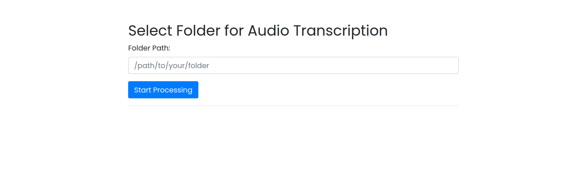
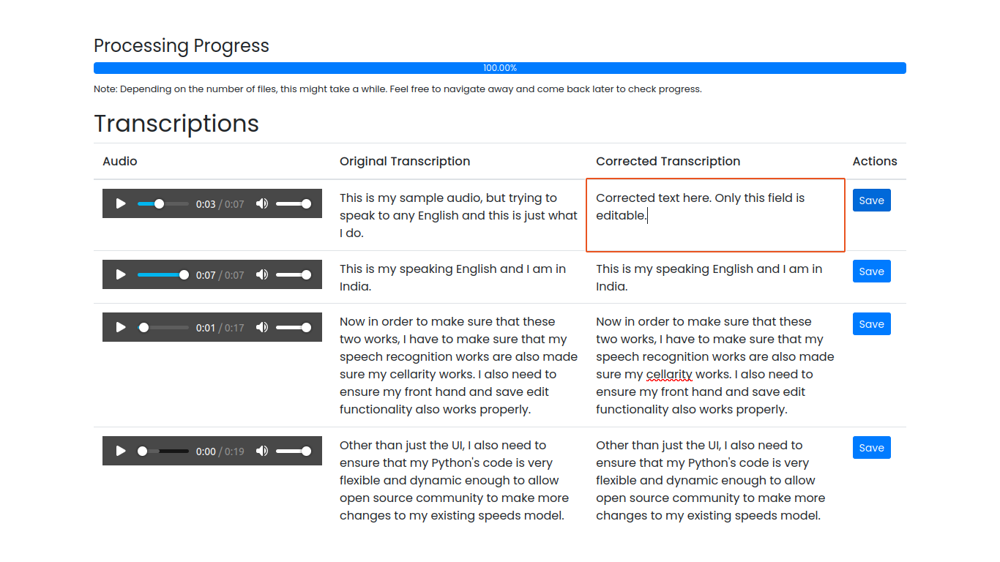
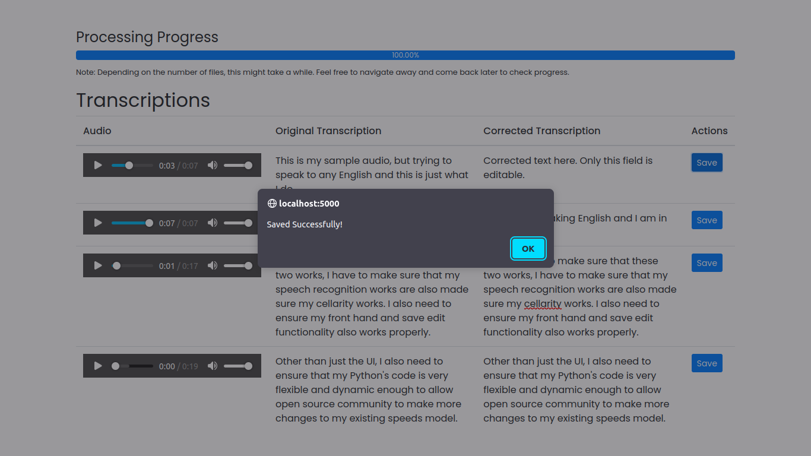

# ASR-Accuracy-Tool :speaker: 

🎙️ A powerful Flask-based web application that leverages the latest Hugging Face ASR models to provide real-time speech-to-text (STT) transcripts with an intuitive user interface for easy correction. Perfect for enhancing the quality of training datasets for ASR models, building awesome NLP Application driving by Accurate text data, and much more. 

## Screenshots :movie_camera: of Application

1. Home Page - It shows an simple form where you get to choose directory which contains your audio files. This could also be directory which contains even more directories. It allows both relative as well as absolute path.

2. Processing Page - This is a dynamic and real-time page based on celery background task that gets updated every 10 seconds with new transcriptions (if they are available). It shows you overall progress based on number of segments total possible. Additionally, it contains an editable column which can be used for corrections. It also allows user to listen to complete audio as they continue to generate.

3. 

:clapper: ***Video Demo Coming Soon...*** 

## Features:
Real-time audio-to-text conversion using state-of-the-art ASR models from Hugging Face.
User-friendly interface for reviewing and correcting transcripts.
Seamless integration with Hugging Face's model hub for easy model selection and updates.
Export corrected transcripts in common formats for training and analysis.
Built with scalability in mind for handling large datasets.

## Why Use It:
Enhance the accuracy of your ASR models by easily creating high-quality training datasets. Correct and fine-tune ASR transcripts with ease, all powered by cutting-edge Hugging Face models.

## Stay Updated: :star: 
🔍 Stay tuned for regular updates as we incorporate the latest advancements in ASR technology!

## To-Do Improvements :construction: 

This project is open for community. You are welcome to join me. I am primarily focusing on the following improvements. 

1. Add custom models for Speech Recognition
2. Add support to Mac & Windows Platforms
3. Memory Optimization of shared resources instead of single model instance per concurrent instance inside celery
4. Add support for more audio extensions
5. Auto Setup and configuration scripts which allows more robustness to changes
6. Improvement to this documentation

Other contributions are also welcome. It will be slightly less in priority but thanks a lot for your inputs.

## Contributions Welcome: 

👩‍💻 Welcome contributions from the community to make this tool even more powerful and accessible to everyone. Join me in creating a better ASR use-cases world!
